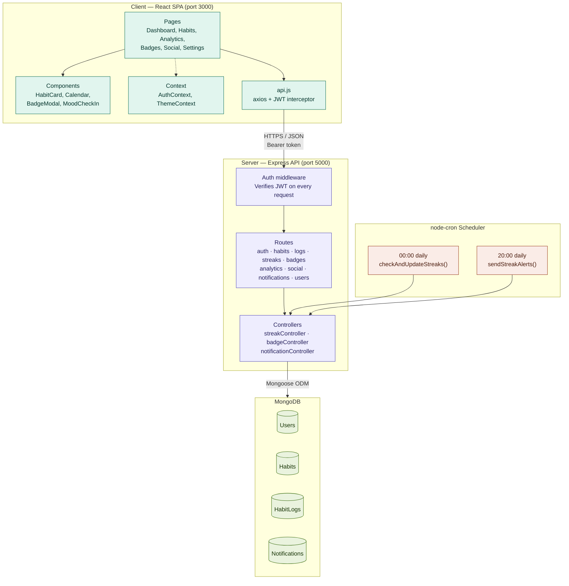

# Bloom — Mental Wellness Streak Tracker

A gamified daily habit-building app built on the **MERN stack** (MongoDB, Express, React, Node.js). Plant small daily habits, watch your streaks grow, and earn badges along the way.

## Stack

- **Frontend:** React 18, React Router 6, Tailwind CSS, Recharts, canvas-confetti, lucide-react
- **Backend:** Node.js, Express, Mongoose (MongoDB), JWT auth, node-cron
- **Database:** MongoDB

## Architecture Diagram



### How a request flows

1. The React SPA calls `api.js` — an axios instance that attaches the JWT from `localStorage` to every request as a `Bearer` token.
2. Express receives the request. The `protect` middleware verifies the JWT; invalid or missing tokens return `401` immediately.
3. The matched route handler (e.g. `POST /api/logs/complete/:habitId`) delegates business logic to the relevant controller.
4. Controllers are the only layer that talks to MongoDB via Mongoose models — `User`, `Habit`, `HabitLog`, `Notification`.
5. On a successful habit completion, the controller runs streak math, checks for new badge unlocks, increments XP, and updates the user's level — all in one request.
6. Two `node-cron` jobs run independently of any HTTP request. Midnight: evaluate every active habit's streak, consume a freeze or break the streak. 8pm: scan for at-risk streaks and write "don't break the chain" notifications. Both reuse the same controllers the API routes use, so the logic only lives in one place.

---

## Project Structure

```
wellness-tracker/
├── server/
│   ├── controllers/
│   │   ├── streakController.js      # Streak calc, freeze logic, nightly check
│   │   ├── badgeController.js       # Badge unlock evaluation, 12 badge types
│   │   └── notificationController.js# Evening alerts, daily quotes, silent hours
│   ├── middleware/
│   │   └── auth.js                  # JWT verify + generateToken helper
│   ├── models/
│   │   ├── User.js                  # Profile, XP, level, friends, badges, reflections
│   │   ├── Habit.js                 # Per-habit config, streak fields, reminder time
│   │   ├── HabitLog.js              # Daily completion record, partial progress, mood
│   │   └── Badge.js                 # Badge definitions + Notification schema
│   ├── routes/
│   │   ├── auth.js                  # register, login, /me, profile update
│   │   ├── habits.js                # CRUD, /presets, /today
│   │   ├── logs.js                  # complete, partial, mood, calendar, overview
│   │   ├── streaks.js               # streak summary, use freeze
│   │   ├── badges.js                # all badges, earned badges + XP
│   │   ├── analytics.js             # success rate, mood correlation, weekly review
│   │   ├── social.js                # friend requests, buddies, nudges, leaderboard
│   │   ├── notifications.js         # list, mark read, delete
│   │   └── users.js                 # public profile endpoint
│   ├── index.js                     # App entry, cron job registration
│   ├── package.json
│   └── .env.example
└── client/
    ├── public/
    │   └── index.html
    └── src/
        ├── components/
        │   ├── habits/
        │   │   ├── HabitCard.js     # One-tap complete, partial steppers, confetti
        │   │   └── AddHabitModal.js # Preset picker + custom icon/color creation
        │   ├── streak/
        │   │   └── BadgeUnlockModal.js
        │   ├── analytics/
        │   │   ├── CalendarView.js  # Monthly grid with mood emoji overlays
        │   │   ├── MoodCheckIn.js   # 5-mood daily rating widget
        │   │   └── WeeklyReviewForm.js
        │   └── layout/
        │       └── Layout.js        # Sidebar nav, mobile top bar, notification panel
        ├── context/
        │   ├── AuthContext.js       # User state, login/register/logout, refreshUser
        │   └── ThemeContext.js      # Dark mode toggle, persists to profile
        ├── pages/
        │   ├── DashboardPage.js     # Today's checklist, stats, mood check-in
        │   ├── HabitsPage.js        # Manage all habits, expand for calendar
        │   ├── AnalyticsPage.js     # Success rate, mood correlation chart
        │   ├── BadgesPage.js        # Earned + locked badges, XP progress
        │   ├── SocialPage.js        # Buddies, friend requests, leaderboard, nudges
        │   ├── SettingsPage.js      # Profile, timezone, dark mode, notifications
        │   ├── LoginPage.js
        │   └── RegisterPage.js
        ├── utils/
        │   └── api.js               # Axios instance + auto-logout interceptor
        ├── App.js                   # Router, PrivateRoute, PublicRoute
        ├── index.js
        └── index.css                # Tailwind base + custom scrollbar + animations
```

---

## Getting Started

### Prerequisites

- Node.js 18+
- A running MongoDB instance (local or [MongoDB Atlas](https://www.mongodb.com/atlas))

### 1. Database

```bash
# Local MongoDB (if installed)
mongod --dbpath ./data

# Or set MONGODB_URI in server/.env to point at an Atlas cluster
```

### 2. Server

```bash
cd server
cp .env.example .env
# Edit .env: set MONGODB_URI and JWT_SECRET at minimum
npm install
npm run dev          # nodemon — auto-restarts on change
# npm start          # plain node for production
```

Server runs at `http://localhost:5000`.

### 3. Client

```bash
cd client
cp .env.example .env
# REACT_APP_API_URL=http://localhost:5000/api  (already set in .env.example)
npm install
npm start
```

App runs at `http://localhost:3000`.

---

## API Reference

| Method | Endpoint | Auth | Description |
|--------|----------|------|-------------|
| POST | `/api/auth/register` | — | Create account |
| POST | `/api/auth/login` | — | Sign in, receive JWT |
| GET | `/api/auth/me` | JWT | Current user profile |
| PUT | `/api/auth/profile` | JWT | Update name, timezone, dark mode, notifications |
| GET | `/api/habits` | JWT | All active habits |
| POST | `/api/habits` | JWT | Create habit (preset or custom) |
| PUT | `/api/habits/:id` | JWT | Update name, icon, color, reminder |
| DELETE | `/api/habits/:id` | JWT | Soft-delete (history preserved) |
| GET | `/api/habits/today` | JWT | Today's habits with completion status |
| GET | `/api/habits/presets` | JWT | Library of 12 preset habits |
| POST | `/api/logs/complete/:habitId` | JWT | Toggle habit complete for today, returns XP + new badges |
| POST | `/api/logs/partial/:habitId` | JWT | Update partial progress (e.g. 4/8 glasses) |
| POST | `/api/logs/mood` | JWT | Log daily mood (1–5) |
| GET | `/api/logs/calendar/:habitId` | JWT | Monthly completion + mood grid |
| GET | `/api/logs/overview` | JWT | All-habits daily completion count |
| GET | `/api/streaks` | JWT | Streak summary for all habits + global streak |
| POST | `/api/streaks/freeze/:habitId` | JWT | Spend a freeze to protect a streak |
| GET | `/api/badges/me` | JWT | Earned badges, locked badges, XP + level |
| GET | `/api/badges/all` | JWT | Full badge definition list |
| GET | `/api/analytics/success-rate/:habitId` | JWT | % days completed (30 or 90 day window) |
| GET | `/api/analytics/mood-correlation` | JWT | Daily completion rate vs. avg mood |
| GET | `/api/analytics/summary` | JWT | Dashboard stats (totals, streak, level) |
| POST | `/api/analytics/weekly-review` | JWT | Submit weekly reflection |
| GET | `/api/analytics/weekly-reviews` | JWT | All past weekly reflections |
| GET | `/api/social/search?email=` | JWT | Find user by email |
| POST | `/api/social/request/:userId` | JWT | Send buddy request |
| POST | `/api/social/respond/:fromUserId` | JWT | Accept or decline buddy request |
| GET | `/api/social/requests` | JWT | Pending incoming requests |
| GET | `/api/social/buddies` | JWT | Buddy list with today's status |
| POST | `/api/social/nudge/:buddyId` | JWT | Send emoji nudge to a buddy |
| GET | `/api/social/leaderboard` | JWT | Friends ranked by global streak |
| GET | `/api/notifications` | JWT | Notification inbox (50 most recent) |
| PUT | `/api/notifications/:id/read` | JWT | Mark one notification read |
| PUT | `/api/notifications/read-all` | JWT | Mark all notifications read |
| DELETE | `/api/notifications/:id` | JWT | Delete a notification |

---

## Implemented Features (All 25+)

### Habit Configuration & Daily Logging
- Preset habit library — Meditate, Journal, Walk, Drink Water, Read, Gratitude, Sleep, Exercise, Breathe, No Screen, Stretch, Affirmations
- Custom habit creation with emoji icon picker and color picker (10 colors)
- Daily checklist dashboard — one distraction-free view of today's habits
- One-tap completion with confetti burst (`canvas-confetti`)
- Partial completion with +/- steppers for quantity-based habits (water glasses, reading pages)

### Streak & Gamification Engine
- Per-habit current streak and longest streak (server-side date diff, timezone-aware)
- Global streak — tracks whether any habit was completed that day
- Streak freezes — earned automatically every 7-day milestone; nightly cron consumes freeze or breaks streak
- 12 badge types — 7 Days Strong, Fortnight Fighter, 30 Day Champion, Century Club, Two Month Legend, Rising Star, Wellness Pro, Juggler, Streak Saver, Social Butterfly, Perfect Week, First Step
- XP + leveling system — 10 XP per completion, `level = floor(xp / 100) + 1`

### Reminders & Notifications
- Per-habit custom reminder time, togglable via bell icon
- Evening "Don't Break the Chain" cron alert at 8pm for at-risk streaks
- Daily motivational quote notification (10 rotating quotes, user-togglable)
- Silent hours — configurable start/end; no notifications generated during that window

### Analytics & Reflection
- Monthly calendar grid per habit with mood emoji overlays on completed days
- Success rate display — % of days completed over 30 or 90 days with circular progress ring
- Mood correlation line chart (Recharts) — daily completion rate vs. average mood, last 30 days
- Weekly reflection form — what went well, what was challenging, 1–5 rating, full history

### Social & Community (Opt-In)
- Accountability buddy system — search by email, send/accept/decline friend requests
- Buddy list showing each friend's streak, level, and whether they've completed anything today
- One-tap emoji nudges — only shown for buddies who haven't completed anything yet today
- Friends leaderboard ranked by global streak

### Account & Data Management
- Email + password auth (JWT, bcrypt-hashed, 30-day token expiry)
- Timezone stored per-user, used for date string generation and cron logic
- All data in MongoDB — durable and accessible from any device on login
- Dark mode toggle — persisted to user profile, applied on every load

---

## Environment Variables

### Server (`server/.env`)

```
PORT=5000
MONGODB_URI=mongodb://localhost:27017/wellness-tracker
JWT_SECRET=change_this_to_a_long_random_string
JWT_EXPIRE=30d
CLIENT_URL=http://localhost:3000

# Optional — for email-based notification delivery
EMAIL_HOST=smtp.gmail.com
EMAIL_PORT=587
EMAIL_USER=your_email@gmail.com
EMAIL_PASS=your_app_password
```

### Client (`client/.env`)

```
REACT_APP_API_URL=http://localhost:5000/api
```

---

## Notes on Production Hardening

This is a complete, runnable reference implementation. Before shipping to real users:

- **Push notifications** — the `Notification` model and cron jobs already generate the right payloads. Add FCM, OneSignal, or `web-push` for actual delivery.
- **OAuth** — the `User` model has a `googleId` field reserved. Wire up Passport.js + `passport-google-oauth20`.
- **Rate limiting** — add `express-rate-limit` on auth endpoints and write routes.
- **Helmet + CORS hardening** — tighten `cors()` origin list and add `helmet()` middleware.
- **Automated tests** — the streak date-diff logic has unit tests. Full integration tests need a real MongoDB instance; `mongodb-memory-server` is the recommended next step.
- **Timezone precision** — current implementation stores dates as `YYYY-MM-DD` strings in the user's declared timezone. For strict midnight handling across DST transitions, store UTC timestamps and derive local date at read time using a library like `date-fns-tz`.
